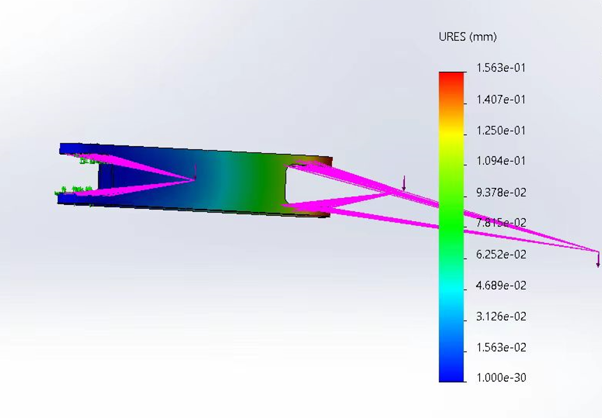
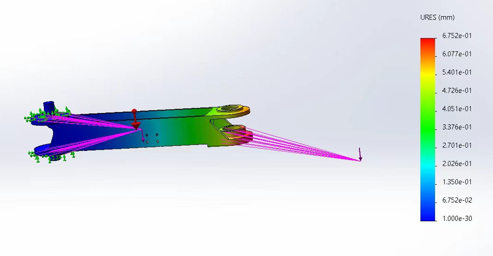
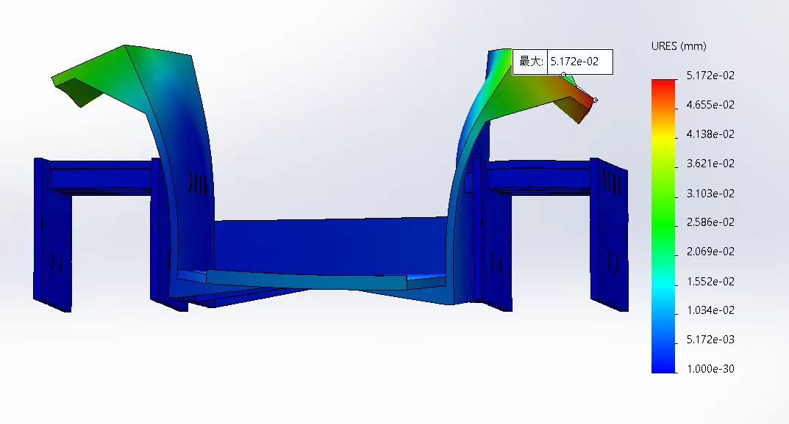
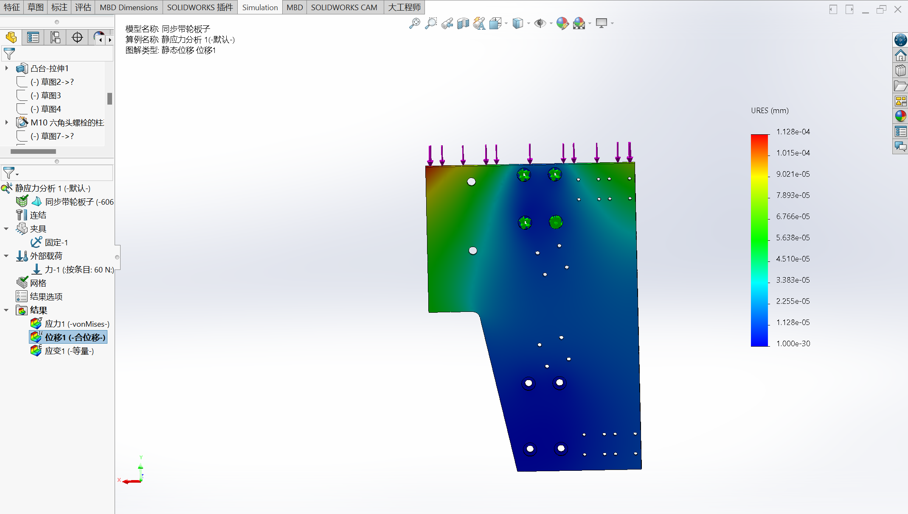
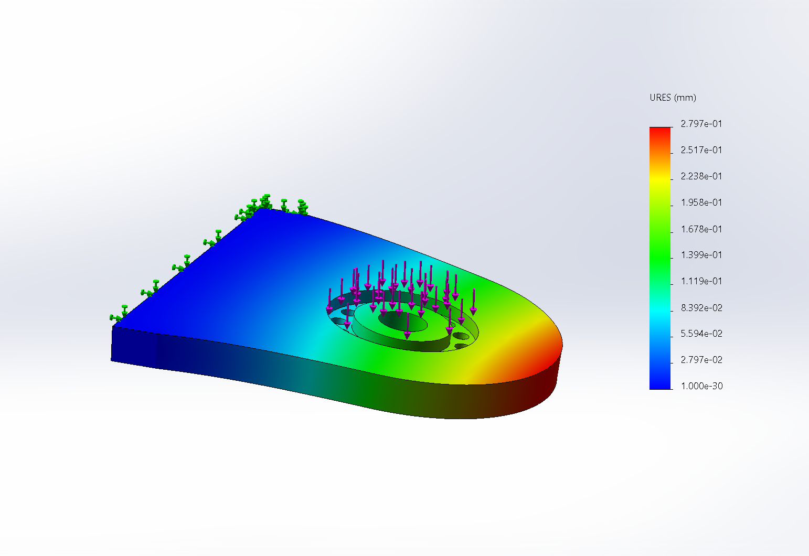
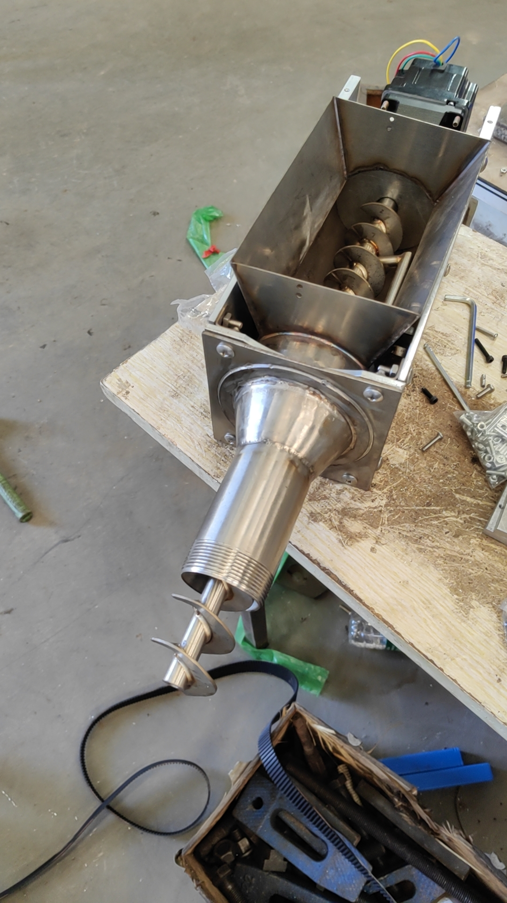
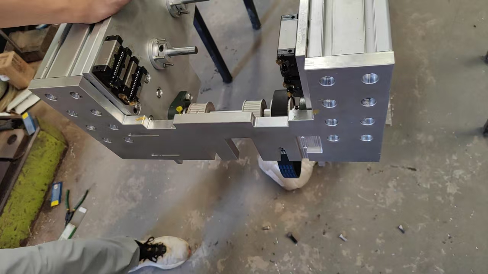
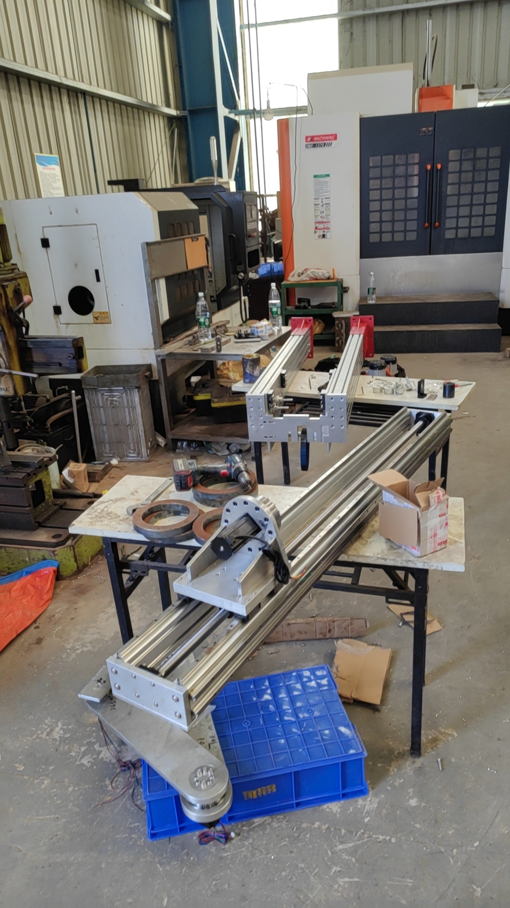
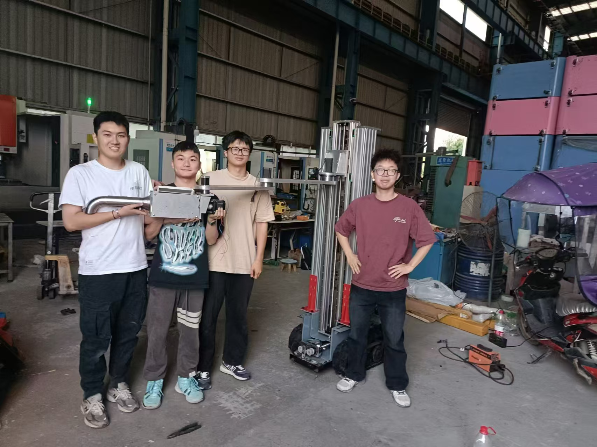

# Artwall v1.0 · 筑墙智匠

**混凝土 3D 打印建筑智能机器人**

> 一款专注高层建筑室内场景的 3D 打印建筑机器人，以 **SLAM 自主导航** 与 **视觉 AI 双运行模式** 替代传统龙门架、导轨与固定基座，可在标准电梯与门洞内自由通行，分段建造大型艺术墙体与隔断墙。

本项目由 **武汉理工大学** 团队研制，在 **尹海斌教授** 指导下完成，对应商业计划产品 **「筑墙智匠」**（Artwall / ATW）。

📄 完整商业计划书见：[BP.pdf](./BP.pdf)

---

## 项目简介

随着中国建筑行业工人老龄化加剧与城市化进程加快，传统人工砌筑在效率、成本与造型自由度上面临严峻挑战。现有大型 3D 打印设备普遍体积庞大、难以进入高层建筑内部——据统计，约 **70%** 的室内 3D 打印需求因设备尺寸问题被迫退回传统工法。

**Artwall v1.0** 针对第四代住宅空中庭院、商超空中花园、商业装潢等场景，集成 **移动底盘 + 升降装置 + 三节机械臂 + 打印头**，实现：

- 🏢 **可上楼**：折叠后约 **600 × 800 × 1800 mm**，整机 **284 kg**，可进出电梯与常规门洞
- 🎯 **高精度**：重复定位精度 **±2 mm**，墙体打印尺寸误差可控
- ⚡ **高效率**：极限工况约 **3 m²/h**，相较熟练人工砌筑提升 **3–5 倍**
- 🎨 **高自由度**：支持曲面、镂空、异形艺术墙体与景观花坛
- 🌱 **绿色低碳**：采用硅酸盐国家重点实验室研发的 3D 打印特种混凝土，材料利用率 **> 95%**

---

## 核心创新

### 双运行模式

| 模式 | 适用场景 | 技术路径 |
|------|----------|----------|
| **预建模 · 视觉定位打印** | 个性化艺术墙体、复杂造型 | 设计师模型 → 一键切片 → 地面粉笔标定 → YOLO 视觉识别 → 坐标系对齐 → 轨迹打印 |
| **预路径 · 视觉自动建模** | 高层平直隔断墙批量施工 | 地面粉笔导引 → 箭头/标志识别 → 首层循迹打印 → 自动建模 → 逐层复现 |

### 与传统方案对比

| 指标 | 人工砌筑 | 固定式大型 3D 打印 | **Artwall v1.0** |
|------|----------|-------------------|------------------|
| 施工效率 | 0.1–0.5 m²/h | 2–5 m²/h | **≈ 3 m²/h** |
| 重复定位 | ±2–5 mm | ±0.5–1 mm | **±2 mm** |
| 自移动能力 | — | 部分可移动 | **履带底盘 + SLAM** |
| 高层室内通行 | ✓ | ✗ | **✓** |
| 复杂曲面/镂空 | 极难 | 支持 | **支持** |
| 综合造价（隔断墙） | ≈ 200 元/m² | — | **≈ 85 元/m²** |

### 知识产权与荣誉

- 3 项实用新型专利（移动底盘、二级升降装置、打印臂）
- 5 项发明专利、2 项软件著作权（申请/受理中）
- **2024 RoboCup 中国机器人大赛国家级一等奖**（央视报道）
- 获 **中建三局科创**、**成都建工预筑科技** 等企业技术验证与高度评价

---

## 系统组成

```
┌─────────────────────────────────────────────────────┐
│                   筑墙智匠 Artwall v1.0              │
├──────────┬──────────┬──────────┬─────────────────────┤
│ 履带移动 │ 二级升降 │ 三节机械 │ 双料打印头           │
│ 底盘     │ 装置     │ 臂       │ (结构层 + 泡沫填充)  │
├──────────┴──────────┴──────────┴─────────────────────┤
│  视觉模块 · SLAM 导航 · 轨迹规划 · 关节驱动 · 自检模块  │
└─────────────────────────────────────────────────────┘
```

| 模块 | 说明 |
|------|------|
| **移动底盘** | 橡胶履带 + 几字形碳钢底板，高度 300 mm，可沉降以打印近地面墙体 |
| **升降装置** | 工作高度 1800–3000 mm，G3 系列伺服 + 滚珠丝杠 + 同步带传动 |
| **机械臂** | 三节折叠臂，第三节采用交叉滚子轴承，整臂质量 33.8 kg |
| **打印头** | 支持顶出/侧向挤出；配合发泡水泥灌填中空结构 |

---

## 展示 Gallery

### 运动仿真

<video src="运动仿真.mp4" controls width="100%">
  <a href="运动仿真.mp4">下载运动仿真视频</a>
</video>

### 有限元与结构仿真

| | | |
|:---:|:---:|:---:|
|  |  |  |
|  |  | |

### 整机与部件动画

<table>
<tr>
<td align="center"><b>总装配</b><br></td>
<td align="center"><b>移动底盘</b><br></td>
<td align="center"><b>升降装置</b><br></td>
</tr>
<tr>
<td align="center"><b>三节机械臂</b><br></td>
<td align="center"><b>打印头</b><br></td>
<td align="center"></td>
</tr>
</table>

### 算法与控制演示

<table>
<tr>
<td align="center"><b>轨迹规划</b><br></td>
<td align="center"><b>打印调试</b><br></td>
</tr>
<tr>
<td align="center" colspan="2"><b>关节运控调试</b><br></td>
</tr>
</table>

### 实物装配过程

<table>
<tr>
<td></td>
<td></td>
<td></td>
<td></td>
</tr>
<tr>
<td align="center">装配 ①</td>
<td align="center">装配 ②</td>
<td align="center">装配 ③</td>
<td align="center">装配 ④</td>
</tr>
<tr>
<td></td>
<td></td>
<td></td>
<td></td>
</tr>
<tr>
<td align="center">装配 ⑤</td>
<td align="center">装配 ⑥</td>
<td align="center">装配 ⑦</td>
<td align="center">团队合影</td>
</tr>
</table>

### 打印成果

<p align="center">
  
</p>

<p align="center"><i>武汉理工大学军山校区实地打印成果 · 艺术墙体 / 景观花坛</i></p>

---

## 应用场景

- 🏠 **第四代住宅** — 空中庭院镂空隔断、曲面花坛、生态绿化墙
- 🏬 **商业综合体** — 商超空中花园主题背景墙、异形展示墙
- 🌿 **园林景观** — 个性化花坛、艺术围墙、景观构件
- 🔧 **二次装修** — 高层室内非承重隔断快速建造

---

## 研发平台与合作

**研发依托：** 武汉理工大学机电学院湖北省数字制造实验室 · 理工—中建三局科创校企联合实验室 · 硅酸盐国家重点实验室 · 理工孵化器

**产业合作：** 成都建工预筑科技 · 中国建筑第三工程局 · 河南土森建筑工程 · 武汉澳华/嘉禾装饰 · 武汉景域园林 等

---

## 团队

团队由 **3 名博士、6 名硕士** 等组成，负责人拥有多项国家发明专利与丰富 A 类竞赛带队经验。项目在 **尹海斌教授** 指导下，以「**Auto Work + Art Wall**」为理念，做混凝土 3D 打印行业的 **艺术墙智造者**。

---

## 引用

如在学术或工程报告中引用本项目，请注明：

```
Artwall v1.0 - A Concrete 3D Printing Robot
Wuhan University of Technology, 2024-2025
https://github.com/Zhu-Qianyu/Artwall-v1.0-A-Concrete-3D-Printing-Robot
```

---

## License

本项目媒体与文档仅供学术交流与展示。商业使用请联系项目团队。

---

<p align="center">
  <b>Artwall · 筑墙智匠</b> — 以 SLAM + 3D 打印 + 视觉 AI，释放建筑艺术的无限可能
</p>
