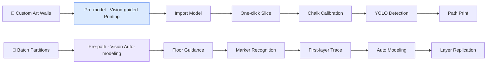

<div align="center">

# 🏗️ Artwall v1.0

## Intelligent Concrete 3D Printing Construction Robot

<br>

[](https://github.com/Zhu-Qianyu/Artwall-v1.0-A-Concrete-3D-Printing-Robot)
[](https://github.com/Zhu-Qianyu/Artwall-v1.0-A-Concrete-3D-Printing-Robot)
[](https://github.com/Zhu-Qianyu/Artwall-v1.0-A-Concrete-3D-Printing-Robot)
[](https://github.com/Zhu-Qianyu/Artwall-v1.0-A-Concrete-3D-Printing-Robot)
[](https://github.com/Zhu-Qianyu/Artwall-v1.0-A-Concrete-3D-Printing-Robot)

<br>

**No Gantry · No Rails · No Fixed Base**

Redefining artistic wall construction in high-rise interiors with **SLAM autonomous navigation** + **Vision AI**

<br>

[📄 Business Plan](./BP.pdf) &nbsp;·&nbsp; [🎬 Motion Simulation](#-motion-simulation) &nbsp;·&nbsp; [🔧 Assembly](#-assembly) &nbsp;·&nbsp; [🏆 Print Results](#-print-results)

<br>


<br>
<sub><i>Wuhan University of Technology Artwall Team · Supervised by Prof. Yin Haibin</i></sub>

</div>

<br>

## ✨ Overview

> **Artwall** is a mobile 3D printing construction robot that fits inside elevators and moves freely across high-rise indoor environments.  
> By replacing bulky gantries and fixed tracks with **SLAM + machine vision**, it enables segmented on-site construction of large-scale architectural structures — turning curved, perforated, and free-form artistic walls from design concepts into printable reality.

<br>

## 📊 Key Specifications

<table align="center">
<tr>
<td align="center" width="20%">
<h2>284 kg</h2>
<b>Total Weight</b><br>
<sub>Fits standard elevators</sub>
</td>
<td align="center" width="20%">
<h2>600×800<br>×1800 mm</h2>
<b>Folded Size</b><br>
<sub>Passes through standard doorways</sub>
</td>
<td align="center" width="20%">
<h2>±2 mm</h2>
<b>Repeatability</b><br>
<sub>Precision motion control</sub>
</td>
<td align="center" width="20%">
<h2>≈3 m²/h</h2>
<b>Build Rate</b><br>
<sub>3–5× faster than manual work</sub>
</td>
<td align="center" width="20%">
<h2>≈85 ¥/m²</h2>
<b>Unit Cost</b><br>
<sub>vs. ~200 ¥/m² manual masonry</sub>
</td>
</tr>
</table>

<br>

## 🧭 Contents

| | | |
|:---:|:---:|:---:|
| [💡 Why Artwall](#-why-artwall) | [⚙️ Dual Operation Modes](#️-dual-operation-modes) | [🏛️ System Architecture](#️-system-architecture) |
| [🎥 Gallery](#-gallery) | [🌐 Applications](#-applications) | [🏅 Awards & IP](#-awards--ip) |
| [🤝 Partners](#-partners) | | |

<br>

---

<br>

## 💡 Why Artwall

<table>
<tr>
<td width="50%" valign="top">

### 😣 Industry Pain Points

- **Aging workforce** — skilled labor shortage keeps growing
- Manual masonry at only **0.1–0.5 m²/h** — slow and costly
- Large 3D printers **cannot enter elevators** — ~**70%** of indoor jobs fall back to traditional methods
- Curved / perforated / free-form designs **hard to build** on site

</td>
<td width="50%" valign="top">

### ✨ The Artwall Answer

- 🏢 **Elevator-ready** — compact foldable design for high-rise indoor access
- ⚡ **High throughput** — up to **42 m²** of partition walls per day
- 🎨 **Design freedom** — artistic walls, planters, and custom geometries
- 🌱 **Greener build** — specialty concrete + monolithic printing, **> 95%** material utilization

</td>
</tr>
</table>

<br>

## ⚙️ Dual Operation Modes

<div align="center">



</div>

<table align="center">
<tr>
<th width="18%">Mode</th>
<th width="22%">Use Case</th>
<th width="60%">Workflow</th>
</tr>
<tr>
<td align="center"><b>🎨 Pre-model<br>Vision-guided</b></td>
<td align="center">Custom artistic walls<br>Complex curves / perforations</td>
<td>Design model → one-click slicing → floor chalk calibration → <b>YOLO</b> vision → coordinate alignment → precision path printing</td>
</tr>
<tr>
<td align="center"><b>🏗️ Pre-path<br>Auto-modeling</b></td>
<td align="center">Straight partition walls<br>High-rise batch construction</td>
<td>Chalk guidance → arrow/marker recognition → first-layer trace print → data logging → auto modeling → layer-by-layer replication</td>
</tr>
</table>

<br>

## 🏛️ System Architecture

<div align="center">

```
╔══════════════════════════════════════════════════════════════╗
║                      🏗️  Artwall v1.0                        ║
╠════════════╦════════════╦════════════╦══════════════════════╣
║  🚜 Tracked ║  ⬆️ Two-   ║  🦾 3-DOF  ║  🖨️ Dual-material   ║
║  Chassis    ║  stage Lift║  Robot Arm ║  Print Head          ║
╠════════════╩════════════╩════════════╩══════════════════════╣
║  👁️ Vision · 🗺️ SLAM · 📐 Path Planning · ⚡ Joint Control    ║
╚══════════════════════════════════════════════════════════════╝
```

</div>

<table align="center">
<tr>
<th>Module</th>
<th>Highlights</th>
</tr>
<tr>
<td align="center"><b>🚜 Mobile Chassis</b></td>
<td>Rubber tracks · steel base frame · 300 mm height · deployable for near-ground printing</td>
</tr>
<tr>
<td align="center"><b>⬆️ Lifting System</b></td>
<td>Working height 1800–3000 mm · G3 servo motors · ball screw + belt drive</td>
</tr>
<tr>
<td align="center"><b>🦾 Robot Arm</b></td>
<td>3-segment foldable arm · cross-roller bearings · 33.8 kg arm mass · high load & precision</td>
</tr>
<tr>
<td align="center"><b>🖨️ Print Head</b></td>
<td>Top / side extrusion modes · foam concrete infill · V-rib hollow structure</td>
</tr>
</table>

<br>

---

<br>

## 🎥 Gallery

### 🎬 Motion Simulation

<div align="center">

<video src="运动仿真.mp4" controls width="92%">
  <a href="运动仿真.mp4">▶ Download motion simulation video</a>
</video>

<br>
<sub>Full-machine kinematic simulation · multi-joint trajectory validation</sub>

</div>

<br>

### 🔬 FEA Structural Simulation

<div align="center">

<table>
<tr>
<td align="center"><br><sub>Sim ①</sub></td>
<td align="center"><br><sub>Sim ②</sub></td>
<td align="center"><br><sub>Sim ③</sub></td>
</tr>
<tr>
<td align="center"><br><sub>Sim ④</sub></td>
<td align="center"><br><sub>Sim ⑤</sub></td>
<td align="center"></td>
</tr>
</table>

</div>

<br>

### ⚙️ Assembly & Component Animations

<div align="center">

<table>
<tr>
<td align="center" width="33%"><br><b>Full Assembly</b></td>
<td align="center" width="33%"><br><b>Mobile Chassis</b></td>
<td align="center" width="33%"><br><b>Lifting System</b></td>
</tr>
<tr>
<td align="center"><br><b>3-DOF Arm</b></td>
<td align="center"><br><b>Print Head</b></td>
<td align="center"></td>
</tr>
</table>

</div>

<br>

### 🧠 Algorithm & Control

<div align="center">

<table>
<tr>
<td align="center" width="50%"><br><b>📐 Path Planning</b></td>
<td align="center" width="50%"><br><b>🖨️ Print Debugging</b></td>
</tr>
<tr>
<td align="center" colspan="2"><br><b>⚡ Joint Motion Control</b></td>
</tr>
</table>

</div>

<br>

### 🔧 Assembly

<div align="center">

<table>
<tr>
<td align="center"><br><sub>Step 01</sub></td>
<td align="center"><br><sub>Step 02</sub></td>
<td align="center"><br><sub>Step 03</sub></td>
<td align="center"><br><sub>Step 04</sub></td>
</tr>
<tr>
<td align="center"><br><sub>Step 05</sub></td>
<td align="center"><br><sub>Step 06</sub></td>
<td align="center"><br><sub>Step 07</sub></td>
<td align="center"></td>
</tr>
</table>

</div>

<br>

### 🏆 Print Results

<div align="center">


<br>

<i>From digital model to physical artifact · on-site validation of 3D-printed concrete art components</i>

</div>

<br>

---

<br>

## 🌐 Applications

<table align="center">
<tr>
<td align="center" width="25%">
<h3>🏠 Fourth-gen Housing</h3>
Sky-garden partitions<br>Curved planters · green walls
</td>
<td align="center" width="25%">
<h3>🏬 Commercial Spaces</h3>
Rooftop gardens<br>Feature walls · display structures
</td>
<td align="center" width="25%">
<h3>🌿 Landscape</h3>
Custom planters<br>Art walls · landscape elements
</td>
<td align="center" width="25%">
<h3>🔧 Renovation</h3>
Non-load-bearing partitions<br>Fast build · low disruption
</td>
</tr>
</table>

<br>

## 🏅 Awards & IP

<div align="center">

| 🥇 Competition Awards | 📜 Intellectual Property | 🤝 Industry Validation |
|:---:|:---:|:---:|
| **RoboCup China 2024** — National First Prize (CCTV coverage)<br>**ICAN Entrepreneurship Competition** — National Third Prize | 3 utility model patents<br>5 invention patents · 2 software copyrights (pending) | CSCEC 3B Sci-Tech Innovation · Chengdu Jian Gong Yuzhu Tech<br>Technical validation & strong endorsement |

</div>

<br>

## 🤝 Partners

<table>
<tr>
<td width="50%" valign="top">

**🔬 R&D Platforms**

- WHUT School of Mech. & Elec. Eng. · Hubei Digital Manufacturing Lab
- WHUT–CSCEC 3B Sci-Tech Innovation Joint Lab
- State Key Lab of Silicate Materials · WHUT Incubator

</td>
<td width="50%" valign="top">

**🏢 Industry Partners**

- Chengdu Jian Gong Yuzhu Technology · China Construction Third Engineering Bureau
- Henan Tusen Construction · Wuhan Aohua / Jiahe Decoration
- Wuhan Jingyu Landscape Design, and more

</td>
</tr>
</table>

<br>

---

<br>

## 📚 Citation

```bibtex
@misc{artwall2025,
  title  = {Artwall v1.0 - A Concrete 3D Printing Robot},
  author = {Wuhan University of Technology Artwall Team},
  year   = {2024--2025},
  url    = {https://github.com/Zhu-Qianyu/Artwall-v1.0-A-Concrete-3D-Printing-Robot}
}
```

<br>

## 📄 License

Media and documentation in this repository are for **academic exchange and demonstration** only. For commercial use, please contact the project team.

<br>

---

<div align="center">

<br>

### 🏗️ Artwall

**SLAM + 3D Printing + Vision AI**

*Unlocking unlimited possibilities for architectural art*

<br>

[](https://github.com/Zhu-Qianyu/Artwall-v1.0-A-Concrete-3D-Printing-Robot)
[](./BP.pdf)

<br>
<sub>Made with ❤️ by WHUT Artwall Team · 2024–2025</sub>

</div>
