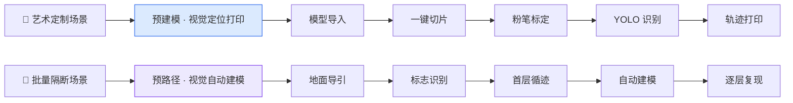

<div align="center">

# 🏗️ Artwall v1.0

## 筑墙智匠 · 混凝土 3D 打印建筑智能机器人

<br>

[](https://github.com/Zhu-Qianyu/Artwall-v1.0-A-Concrete-3D-Printing-Robot)
[](https://github.com/Zhu-Qianyu/Artwall-v1.0-A-Concrete-3D-Printing-Robot)
[](https://github.com/Zhu-Qianyu/Artwall-v1.0-A-Concrete-3D-Printing-Robot)
[](https://github.com/Zhu-Qianyu/Artwall-v1.0-A-Concrete-3D-Printing-Robot)

<br>

**无龙门 · 无导轨 · 无固定基座**

用 **SLAM 自主导航** + **视觉 AI** 重新定义高层建筑内的艺术墙体建造方式

<br>

[📄 商业计划书](./BP.pdf) &nbsp;·&nbsp; [🎬 运动仿真](#-运动仿真) &nbsp;·&nbsp; [🔧 装配纪实](#-装配纪实) &nbsp;·&nbsp; [🏆 打印成果](#-打印成果)

<br>


<br>
<sub><i>武汉理工大学军山校区 · 艺术墙体 / 景观花坛实地打印成果</i></sub>

</div>

<br>

## ✨ 一句话介绍

> **Artwall** 是一款可进出电梯、在高层室内自由行走的 3D 打印建筑机器人。  
> 它抛弃传统大型龙门与固定轨道，以 **SLAM + 机器视觉** 实现自主定位与分段施工，  
> 让曲面、镂空、异形艺术墙体的建造，从「图纸上的想象」变成「现场可打印的现实」。

<br>

## 📊 核心数据一览

<table align="center">
<tr>
<td align="center" width="20%">
<h2>284 kg</h2>
<b>整机重量</b><br>
<sub>可进出标准电梯</sub>
</td>
<td align="center" width="20%">
<h2>600×800<br>×1800 mm</h2>
<b>折叠尺寸</b><br>
<sub>适配常规门洞通行</sub>
</td>
<td align="center" width="20%">
<h2>±2 mm</h2>
<b>重复定位精度</b><br>
<sub>微米级运动控制</sub>
</td>
<td align="center" width="20%">
<h2>≈3 m²/h</h2>
<b>建造效率</b><br>
<sub>较人工提升 3–5 倍</sub>
</td>
<td align="center" width="20%">
<h2>≈85 元/m²</h2>
<b>综合造价</b><br>
<sub>传统砌筑约 200 元/m²</sub>
</td>
</tr>
</table>

<br>

## 🧭 目录

| | | |
|:---:|:---:|:---:|
| [💡 为何需要 Artwall](#-为何需要-artwall) | [⚙️ 双运行模式](#️-双运行模式) | [🏛️ 系统架构](#️-系统架构) |
| [📈 竞品对比](#-竞品对比) | [🎥 视觉展示](#-视觉展示) | [🌐 应用场景](#-应用场景) |
| [🏅 荣誉与专利](#-荣誉与专利) | [🤝 合作平台](#-合作平台) | [👥 团队](#-团队) |

<br>

---

<br>

## 💡 为何需要 Artwall

<table>
<tr>
<td width="50%" valign="top">

### 😣 行业痛点

- 建筑工人 **老龄化**，熟练工缺口持续扩大
- 传统人工砌筑 **0.1–0.5 m²/h**，工期长、成本高
- 大型 3D 打印设备 **无法进入电梯**，约 **70%** 室内需求被迫放弃
- 曲面 / 镂空 / 异形设计 **难以落地**，设计自由度严重受限

</td>
<td width="50%" valign="top">

### ✨ Artwall 的回答

- 🏢 **可上楼** — 折叠便携，高层室内无障碍通行
- ⚡ **高效率** — 自动化打印，单日极限约 **42 m²** 隔断墙
- 🎨 **高自由度** — 艺术墙体、景观花坛、异形构件一站完成
- 🌱 **更绿色** — 特种混凝土 + 一体化成型，材料利用率 **> 95%**

</td>
</tr>
</table>

<br>

## ⚙️ 双运行模式

<div align="center">



</div>

<table align="center">
<tr>
<th width="18%">模式</th>
<th width="22%">适用场景</th>
<th width="60%">技术路径</th>
</tr>
<tr>
<td align="center"><b>🎨 预建模<br>视觉定位</b></td>
<td align="center">个性化艺术墙体<br>复杂曲面 / 镂空造型</td>
<td>设计师模型 → 一键切片 → 地面粉笔标定 → <b>YOLO</b> 视觉识别 → 坐标对齐 → 精准轨迹打印</td>
</tr>
<tr>
<td align="center"><b>🏗️ 预路径<br>自动建模</b></td>
<td align="center">高层平直隔断墙<br>批量重复施工</td>
<td>粉笔导引 → 箭头标志识别 → 首层循迹打印 → 数据记录 → 自动建模 → 逐层复现</td>
</tr>
</table>

<br>

## 🏛️ 系统架构

<div align="center">

```
╔══════════════════════════════════════════════════════════════╗
║                    🏗️  筑墙智匠  Artwall v1.0                ║
╠════════════╦════════════╦════════════╦══════════════════════╣
║  🚜 履带   ║  ⬆️ 二级   ║  🦾 三节   ║  🖨️ 双料打印头       ║
║  移动底盘  ║  升降装置  ║  机械臂    ║  结构层 + 泡沫填充   ║
╠════════════╩════════════╩════════════╩══════════════════════╣
║   👁️ 视觉模块  ·  🗺️ SLAM 导航  ·  📐 轨迹规划  ·  ⚡ 关节驱动   ║
╚══════════════════════════════════════════════════════════════╝
```

</div>

<table align="center">
<tr>
<th>模块</th>
<th>关键参数 / 特点</th>
</tr>
<tr>
<td align="center"><b>🚜 移动底盘</b></td>
<td>橡胶履带 · 几字形碳钢底板 · 高度 300 mm · 可沉降打印近地面墙体</td>
</tr>
<tr>
<td align="center"><b>⬆️ 升降装置</b></td>
<td>工作高度 1800–3000 mm · G3 伺服电机 · 滚珠丝杠 + 同步带传动</td>
</tr>
<tr>
<td align="center"><b>🦾 机械臂</b></td>
<td>三节折叠结构 · 交叉滚子轴承 · 整臂质量 33.8 kg · 高负载高精度</td>
</tr>
<tr>
<td align="center"><b>🖨️ 打印头</b></td>
<td>顶出 / 侧向双模式挤出 · 发泡水泥灌填 · V 型加强筋中空结构</td>
</tr>
</table>

<br>

## 📈 竞品对比

<table align="center">
<tr>
<th>指标</th>
<th>👷 人工砌筑</th>
<th>🏭 固定式大型 3D 打印</th>
<th>🏗️ <b>Artwall v1.0</b></th>
</tr>
<tr>
<td align="center"><b>施工效率</b></td>
<td align="center">0.1–0.5 m²/h</td>
<td align="center">2–5 m²/h</td>
<td align="center">✅ <b>≈ 3 m²/h</b></td>
</tr>
<tr>
<td align="center"><b>重复定位</b></td>
<td align="center">±2–5 mm</td>
<td align="center">±0.5–1 mm</td>
<td align="center">✅ <b>±2 mm</b></td>
</tr>
<tr>
<td align="center"><b>自移动能力</b></td>
<td align="center">—</td>
<td align="center">部分可移动</td>
<td align="center">✅ <b>履带 + SLAM</b></td>
</tr>
<tr>
<td align="center"><b>高层室内通行</b></td>
<td align="center">✅</td>
<td align="center">❌</td>
<td align="center">✅ <b>可进电梯</b></td>
</tr>
<tr>
<td align="center"><b>复杂曲面 / 镂空</b></td>
<td align="center">❌ 极难</td>
<td align="center">✅ 支持</td>
<td align="center">✅ <b>支持</b></td>
</tr>
<tr>
<td align="center"><b>综合造价</b></td>
<td align="center">≈ 200 元/m²</td>
<td align="center">—</td>
<td align="center">✅ <b>≈ 85 元/m²</b></td>
</tr>
</table>

<br>

---

<br>

## 🎥 视觉展示

### 🎬 运动仿真

<div align="center">

<video src="运动仿真.mp4" controls width="92%">
  <a href="运动仿真.mp4">▶ 点击下载运动仿真视频</a>
</video>

<br>
<sub>整机运动学仿真 · 多关节协同轨迹验证</sub>

</div>

<br>

### 🔬 有限元结构仿真

<div align="center">

<table>
<tr>
<td align="center"><br><sub>仿真 ①</sub></td>
<td align="center"><br><sub>仿真 ②</sub></td>
<td align="center"><br><sub>仿真 ③</sub></td>
</tr>
<tr>
<td align="center"><br><sub>仿真 ④</sub></td>
<td align="center"><br><sub>仿真 ⑤</sub></td>
<td align="center"></td>
</tr>
</table>

</div>

<br>

### ⚙️ 整机与部件拆解动画

<div align="center">

<table>
<tr>
<td align="center" width="33%"><br><b>总装配</b></td>
<td align="center" width="33%"><br><b>移动底盘</b></td>
<td align="center" width="33%"><br><b>升降装置</b></td>
</tr>
<tr>
<td align="center"><br><b>三节机械臂</b></td>
<td align="center"><br><b>打印头</b></td>
<td align="center"></td>
</tr>
</table>

</div>

<br>

### 🧠 算法与控制演示

<div align="center">

<table>
<tr>
<td align="center" width="50%"><br><b>📐 轨迹规划</b></td>
<td align="center" width="50%"><br><b>🖨️ 打印调试</b></td>
</tr>
<tr>
<td align="center" colspan="2"><br><b>⚡ 关节运控调试</b></td>
</tr>
</table>

</div>

<br>

### 🔧 装配纪实

<div align="center">

<table>
<tr>
<td align="center"><br><sub>Step 01</sub></td>
<td align="center"><br><sub>Step 02</sub></td>
<td align="center"><br><sub>Step 03</sub></td>
<td align="center"><br><sub>Step 04</sub></td>
</tr>
<tr>
<td align="center"><br><sub>Step 05</sub></td>
<td align="center"><br><sub>Step 06</sub></td>
<td align="center"><br><sub>Step 07</sub></td>
<td align="center"><br><sub>团队合影</sub></td>
</tr>
</table>

</div>

<br>

### 🏆 打印成果

<div align="center">


<br>

<i>从模型到实体 · 混凝土 3D 打印艺术构件落地验证</i>

</div>

<br>

---

<br>

## 🌐 应用场景

<table align="center">
<tr>
<td align="center" width="25%">
<h3>🏠 第四代住宅</h3>
空中庭院镂空隔断<br>曲面花坛 · 生态绿化墙
</td>
<td align="center" width="25%">
<h3>🏬 商业综合体</h3>
商超空中花园<br>主题背景墙 · 异形展示墙
</td>
<td align="center" width="25%">
<h3>🌿 园林景观</h3>
个性化花坛<br>艺术围墙 · 景观构件
</td>
<td align="center" width="25%">
<h3>🔧 二次装修</h3>
高层室内非承重墙<br>快速建造 · 低扰施工
</td>
</tr>
</table>

<br>

## 🏅 荣誉与专利

<div align="center">

| 🥇 竞赛荣誉 | 📜 知识产权 | 🤝 企业验证 |
|:---:|:---:|:---:|
| **2024 RoboCup 中国机器人大赛**<br>🏆 国家级一等奖 · 央视报道 | 3 项实用新型专利<br>5 项发明专利 · 2 项软著（受理中） | 中建三局科创 · 成都建工预筑科技<br>技术验证 · 高度评价 |

</div>

<br>

## 🤝 合作平台

<table>
<tr>
<td width="50%" valign="top">

**🔬 研发依托**

- 武汉理工大学机电学院 · 湖北省数字制造实验室
- 理工—中建三局科创校企联合实验室
- 硅酸盐国家重点实验室 · 理工孵化器

</td>
<td width="50%" valign="top">

**🏢 产业合作**

- 成都建工预筑科技 · 中国建筑第三工程局
- 河南土森建筑工程 · 武汉澳华 / 嘉禾装饰
- 武汉景域园林景观设计工程 等

</td>
</tr>
</table>

<br>

## 👥 团队

<div align="center">

**武汉理工大学 Artwall 团队** · 尹海斌教授指导

<br>

3 名博士 · 6 名硕士 · 多项国家发明专利 · 丰富 A 类竞赛经验

<br>

> **Auto Work** — 让建造更智能 &nbsp;|&nbsp; **Art Wall** — 让墙体成艺术

<br>

<i>做混凝土 3D 打印行业的「艺术墙智造者」</i>

</div>

<br>

---

<br>

## 📚 引用

```bibtex
@misc{artwall2025,
  title  = {Artwall v1.0 - A Concrete 3D Printing Robot},
  author = {Wuhan University of Technology Artwall Team},
  year   = {2024--2025},
  url    = {https://github.com/Zhu-Qianyu/Artwall-v1.0-A-Concrete-3D-Printing-Robot}
}
```

<br>

## 📄 License

本项目媒体与文档仅供 **学术交流与展示**。商业使用请联系项目团队。

<br>

---

<div align="center">

<br>

### 🏗️ Artwall · 筑墙智匠

**SLAM + 3D 打印 + 视觉 AI**

*释放建筑艺术的无限可能*

<br>

[](https://github.com/Zhu-Qianyu/Artwall-v1.0-A-Concrete-3D-Printing-Robot)
[](./BP.pdf)

<br>
<sub>Made with ❤️ by WHUT Artwall Team · 2024–2025</sub>

</div>
